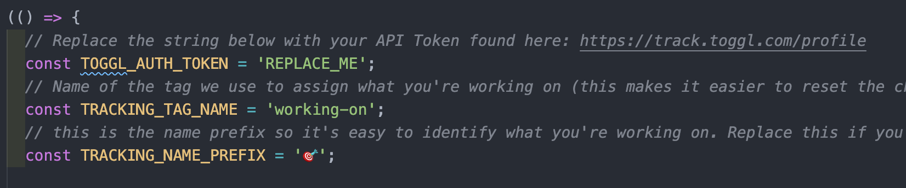

# of-start-toggl-timer
A omnifocus plugin to seamlessly start [Toggl](https://track.toggl.com/timer) timers from inside [OmniFocus](https://www.omnigroup.com/omnifocus/)

## What it does

When you highlight a task in OmniFocus and then kick off this automation, a timer will be started with:
- Description as the name of the task
- Tags copied over from OmniFocus
- Project used from the task the project is contained in within OmniFocus. The script will create a new Project if the project doesn't exist in Toggl.

## How to install on Mac
1. Download latest release from [here](https://github.com/benhughes/of-start-toggl-timer/releases)
2. Unzip and open the file called `of-start-toggle-timer.omnifocusjs` this should open the file in OmniFocus
3. Choose if you would like to install on Mac (to only use locally) or "OmniFocus in iCloud Drive" (to make it available across platforms (including iPhone and iPad)

4. Choose Automation > Configure in the menu
5. Choose `of-start-toggle-timer` in menu and click `Reveal in Finder` 
6. Open the file in your favourite text editor
7. Replace 'REPLACE_ME' with you toggl API Token that can be found [here](https://track.toggl.com/profile)

8. You should now be all set up and can start a timer by clicking on a task and choosing Automation > Start Timer from the menu.

Note: if anyone knows of a way to store data other then having to edit a file as described then please let me know as it seems it should be easier then this but the documentation is not great.
